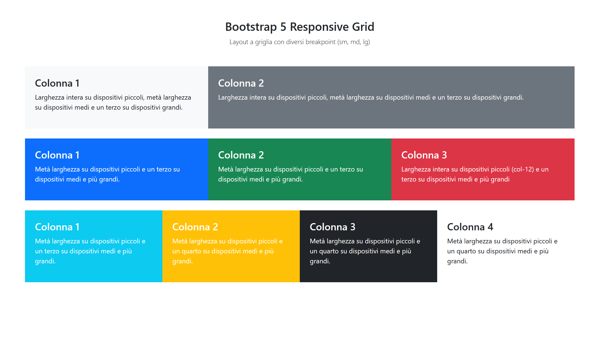
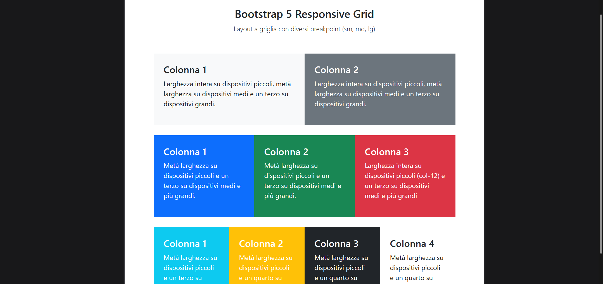
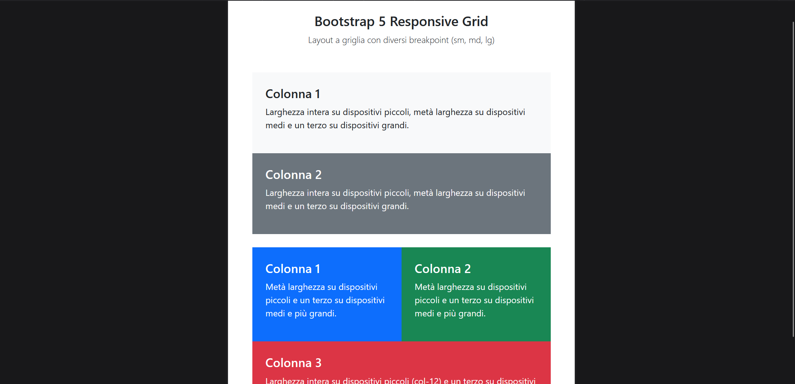

<h1 align="center">Bootstrap Grid Layout</h1>

  Esercizio svolto durante il corso Boolean per esercitarmi nella creazione di un layout responsive con la griglia di Bootstrap 5.

## Obiettivo

- Riprodurre il layout fornito negli screenshot utilizzando esclusivamente la griglia di Bootstrap 5.
- Adattare la disposizione delle colonne in base alla larghezza del dispositivo (desktop, tablet, mobile).
- Sfruttare le utility class di Bootstrap per:
  - centralizzare il testo (es. `text-center`, `text-white`);
  - gestire gli spazi (es. `p-*`, `m-*`);
  - usare `row-cols-*` dove possibile per impostare il numero di colonne nelle righe.

## Anteprima

### Desktop

### Tablet

### Mobile

> 🔹 Sostituisci i nomi dei file con quelli reali che hai salvato nella cartella `img`.

## Tecnologie utilizzate

- HTML  
- Bootstrap 5 (griglia e utility class)
